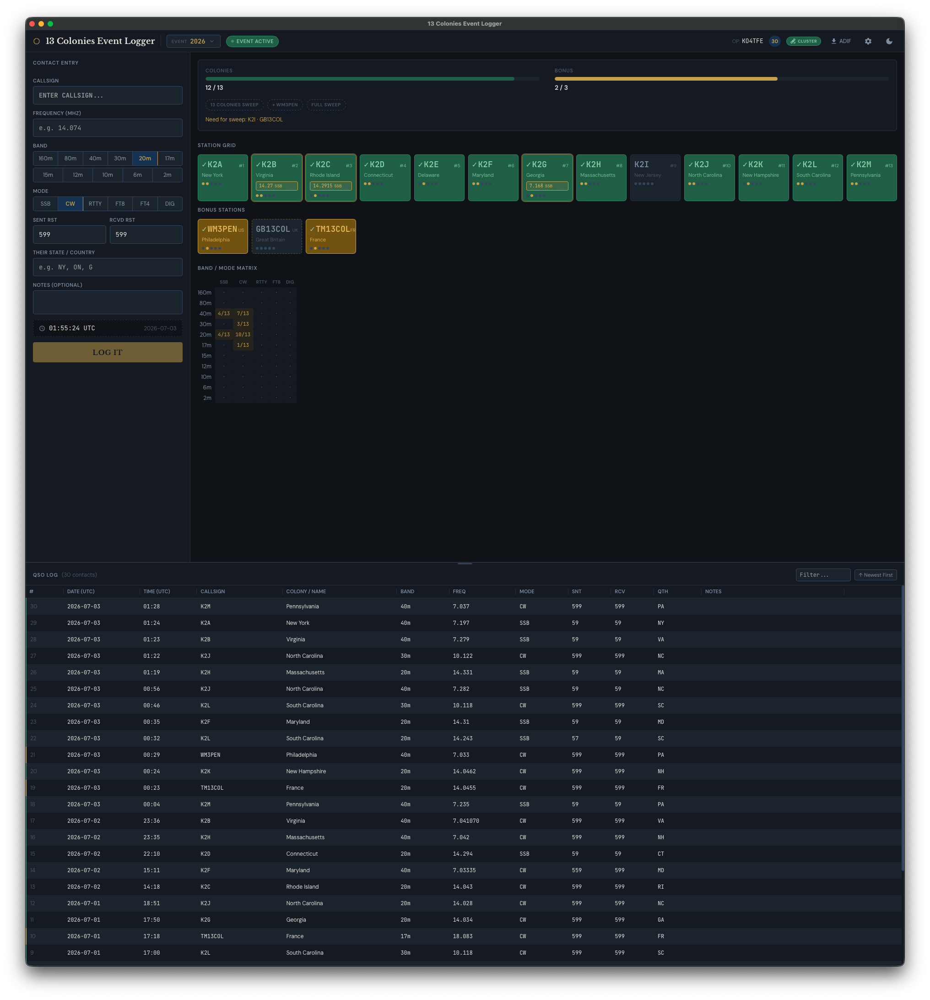
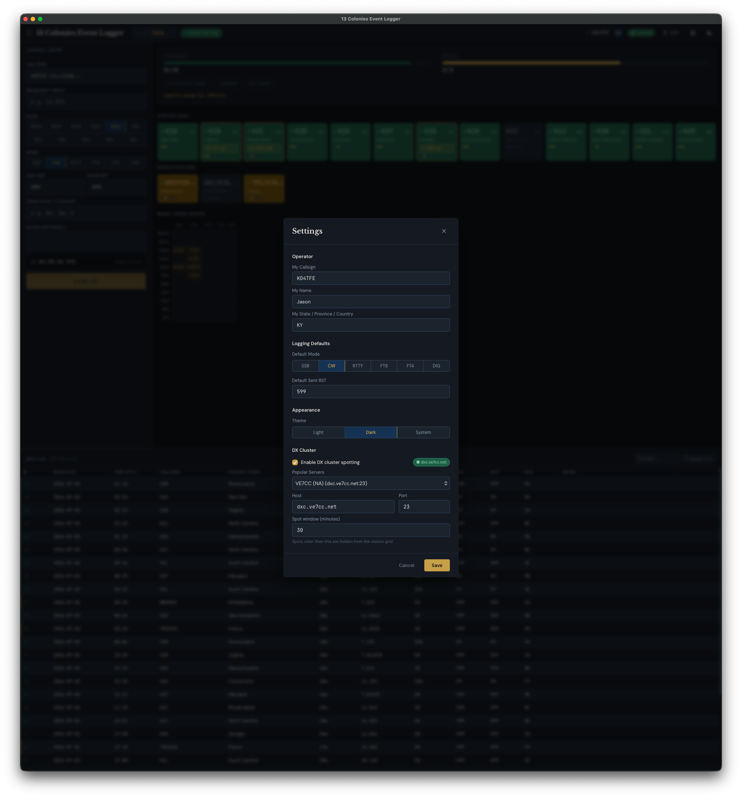

# 13 Colonies Event Logger

A cross-platform desktop logging application for the [13 Colonies Special Event](https://www.13colonies.us) — an annual amateur radio event held July 1–7 where operators chase special event stations representing each of the original 13 American colonies plus bonus stations.

Built with [Tauri 2.0](https://tauri.app) (Rust backend), React, and TypeScript. All data is stored locally in a SQLite database — no internet connection required during operation.

---

## Screenshots


*Main interface showing the contact entry panel, sweep tracker, station grid, and QSO log*


*First-run setup and settings dialog*


---

## Features

- **Fast keyboard-driven contact logging** — full tab order from callsign to Log It, Enter key logs from any field once required info is entered
- **DX Cluster integration; only showing spots that you need
- **Auto band detection** — type a frequency in MHz and the correct band is selected automatically
- **Dupe detection** — alerts when a callsign + band + mode combination has already been logged (non-blocking)
- **Colony recognition** — automatically identifies and labels all 16 special event stations (K2A–K2M plus bonus stations)
- **Sweep progress tracking** — at-a-glance progress bars, achievement badges, and "needed for sweep" callout
- **Station grid** — visual tiles for all 16 stations with worked/unworked state, band/mode pip indicators, and hover detail tooltips
- **Band/Mode matrix** — color-coded table showing how many unique colony stations have been worked on each band and mode combination
- **Multi-year event logs** — create and switch between logs for each year's event; all data stored in SQLite
- **ADIF export** — export your log to standard ADIF 3.1.4 format for submission and upload to LoTW, QRZ, or any logging software
- **Inline log editing** — edit any field including time directly in the QSO log table
- **Dark and light themes** — follows system preference or manually toggled
- **Resizable layout** — drag the handle between the main area and log panel to resize; drag column headers to resize log columns

---

## The Event

The 13 Colonies Special Event runs annually from **July 1 at 9:00 AM Eastern (13:00 UTC)** to **July 7 at midnight Eastern (July 8, 04:00 UTC)**.

### Stations

| Callsign | Colony | State |
|---|---|---|
| K2A | New York | NY |
| K2B | Virginia | VA |
| K2C | Rhode Island | RI |
| K2D | Connecticut | CT |
| K2E | Delaware | DE |
| K2F | Maryland | MD |
| K2G | Georgia | GA |
| K2H | Massachusetts | MA |
| K2I | New Jersey | NJ |
| K2J | North Carolina | NC |
| K2K | New Hampshire | NH |
| K2L | South Carolina | SC |
| K2M | Pennsylvania | PA |
| WM3PEN | Philadelphia Bonus | PA |
| GB13COL | Great Britain Bonus | UK |
| TM13COL | France Bonus | FR |

### Sweep Tiers

| Achievement | Requirement |
|---|---|
| Colony Sweep | Work all 13 colonies (K2A–K2M) |
| Enhanced Sweep | All 13 colonies + WM3PEN |
| Full Sweep | All 13 colonies + WM3PEN + GB13COL + TM13COL |

### Exchange

Each QSO exchange is: **Callsign · RS(T) · State/Province/Country**

### Bands and Modes

All HF bands except 60m (160m through 10m, including WARC bands), plus 6m and 2m simplex. All modes: SSB, CW, RTTY, FT8, FT4, and other digital modes.

---

## Installation

### Download a Release

Download the latest installer for your platform from the [Releases](../../releases) page:

- **macOS** — `.dmg` (universal binary for Apple Silicon and Intel)
- **Windows** — `.msi` installer
- **Linux** — `.AppImage` or `.deb`

### Build from Source

**Prerequisites:**

- [Node.js](https://nodejs.org) 18 or later
- [Rust](https://rustup.rs) stable toolchain
- Platform build dependencies:
  - **Linux:** `libwebkit2gtk-4.1-dev libappindicator3-dev librsvg2-dev patchelf`
  - **macOS/Windows:** no additional dependencies

```bash
git clone https://github.com/KidVizious/13-colonies-logger
cd 13-colonies-logger
npm install
npm run tauri build
```

The built app and installer will be in `src-tauri/target/release/bundle/`.

---

## Usage

### First Launch

On first launch, a setup dialog will appear asking for your callsign, name, and state/province/country. These are required for the QSO exchange and ADIF export. You can change them at any time via the settings gear icon.

### Logging a Contact

1. **Callsign** — type the station callsign (auto-uppercase). Recognized colony and bonus station callsigns are identified automatically and the QTH field is pre-filled.
2. **Frequency** — optionally enter the frequency in MHz (e.g. `14.225`). The correct band is selected automatically.
3. **Band** — select manually if frequency was not entered.
4. **Mode** — select SSB, CW, RTTY, FT8, FT4, or DIG. RST fields auto-fill to appropriate defaults (59 for SSB, 599 for others).
5. **Sent RST / Rcvd RST** — edit if needed.
6. **Their State/Country** — pre-filled for known stations; enter manually for other callsigns.
7. **Notes** — optional.
8. Press **Enter** from any field (once callsign is entered) or click **LOG IT** to save the QSO.

Clicking the spot info on a tile will pre-fill the contact entry window with the station, frequency and mode.

After logging, the callsign field clears and focuses automatically — band, mode, and frequency are retained for the next QSO.

### Keyboard Shortcuts

| Shortcut | Action |
|---|---|
| `Enter` | Log the contact (from any entry field) |
| `Ctrl/Cmd + L` | Jump focus to callsign field |
| `Escape` | Clear the callsign field |
| `Ctrl/Cmd + Z` | Undo the last logged QSO (within 10 seconds) |

### Dupe Warning

If a callsign + band + mode combination has already been logged, a red **DUPE** badge appears in the callsign field with a note showing the previous QSO's band and mode. The warning is non-blocking — you can still log the contact (e.g. for a different band/mode later in the session, or a deliberate second QSO).

### Reading the Station Grid

Each station tile shows:
- **Callsign** and colony/bonus name
- **Green background** — worked at least once
- **Gold border** — bonus station (WM3PEN, GB13COL, TM13COL)
- **Band/mode pips** — five small dots at the bottom of each worked tile representing SSB, CW, RTTY, FT8, and DIG. Filled = worked on that mode.
- **Hover** — shows a full band × mode breakdown for that station

### Reading the Band/Mode Matrix

The matrix shows how many unique colony/bonus stations have been worked on each band and mode combination:
- **·** (dot) — no contacts on this band/mode
- **Amber number** — partial (some stations worked)
- **Green number** — all 13 colony stations worked on this band/mode

### Editing Log Entries

Hover over any row in the QSO log to reveal **Edit** and **Delete** buttons. Clicking Edit makes the row fields editable inline, including the UTC time. Press Enter or click the checkmark to save, or Escape/× to cancel.

To resize the log panel, drag the horizontal handle between the main area and the log. To resize columns, drag the vertical dividers in the table header.

### Switching Event Years

Click the **EVENT YYYY** dropdown in the toolbar to switch between logged years or create a new event log for a new year. Each year's contacts are stored independently.

### Exporting ADIF

Click **↓ ADIF** in the toolbar to export the current year's QSO log. A save dialog will open — choose a filename and location. The ADIF file includes all standard fields plus `SIG`/`SIG_INFO` fields for the 13 Colonies event, compatible with LoTW, QRZ, and other logging software.

---

## Data Storage

All data is stored in a SQLite database at the platform-appropriate location:

| Platform | Path |
|---|---|
| macOS | `~/Library/Application Support/com.13colonies.logger/13colonies.db` |
| Windows | `%APPDATA%\13colonies\logger\data\13colonies.db` |
| Linux | `~/.local/share/13colonies/logger/13colonies.db` |

To back up your logs, copy this file. To move your logs to another machine, copy the file to the same path on the new machine.

---

## Building a Release

Push a version tag to trigger the GitHub Actions workflow, which builds installers for macOS (universal), Windows, and Linux and creates a draft release:

```bash
git tag v1.0.0
git push origin v1.0.0
```

Review and publish the draft release on GitHub once the builds complete.

---

## License

MIT
